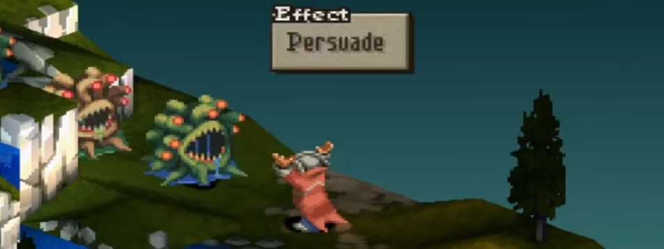

    
     
    <i>"Please turn into a less terrible file format..."</i>

# GIF to WebM Serverless Lambda API

Uses FFmpeg to convert animated GIFs to WebM video files on demand.

Configured for [AWS Lambda](https://aws.amazon.com/lambda/) using the [Serverless Framework](https://serverless.com/).

## Motivation

- Most renderers like [Three.js](https://threejs.org/) or [PixiJS](https://pixijs.com/) do not support GIFs as textures but support video files.
- WebMs can massively reduce file size.
- Generally more performant than existing methods of parsing and loading GIFs as textures.

[//]: # (TODO: insert gif webm comparison)

I specifically made this API in order to dynamically load Twitch and BTTV animated emotes into PixiJS for streamer
overlays. There were some existing methods but the performance generally suffered when trying to load thousands of
emotes.

### Known Issues

- Delay on the last frame gets dropped. This can cause the loop timing of some animations to be off. This is
  a [known issue with FFMPEG.](https://trac.ffmpeg.org/ticket/6294#comment:6) Working on implementing fix for next
  release.

### Roadmap

- Would like to eventually implemented this with [FFmpeg WASM](https://github.com/ffmpegwasm/ffmpeg.wasm) as well so
  conversion can be done completely in browser.
- Add caching to cache previously requested URLs.
- I plan to restrict public API to only convert URLs from Twitch and BTTV to prevent general usage making my AWS 
  bill go crazy

### Credits

- https://www.norrapscm.com/posts/2021-02-08-generate-thumbnails-in-lambda-from-s3-with-ffmpeg
- https://github.com/CalebBabin/twitch-chat-emotes
- https://gist.github.com/AlcaDesign/6213ff17d3981c861adf